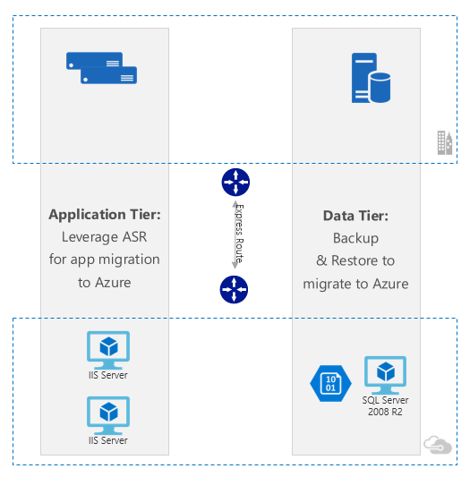
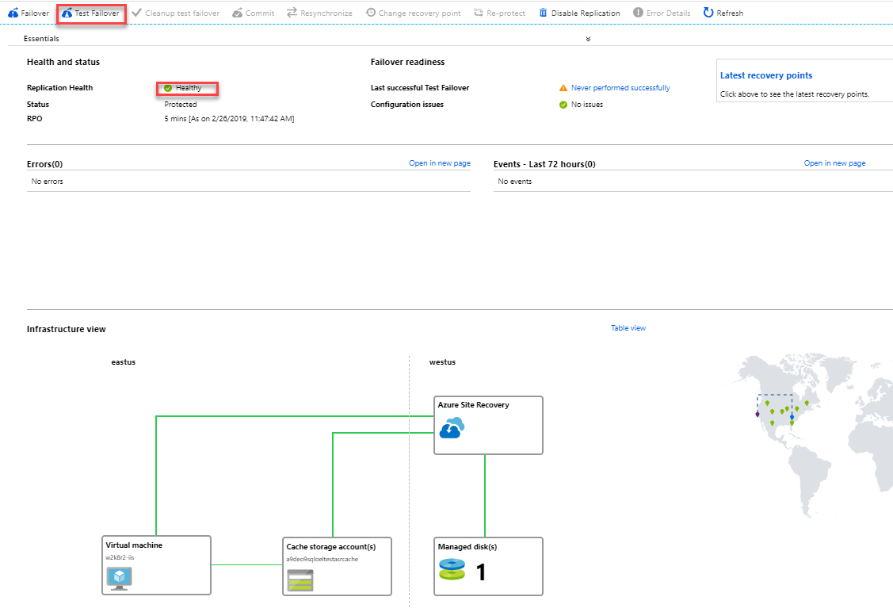
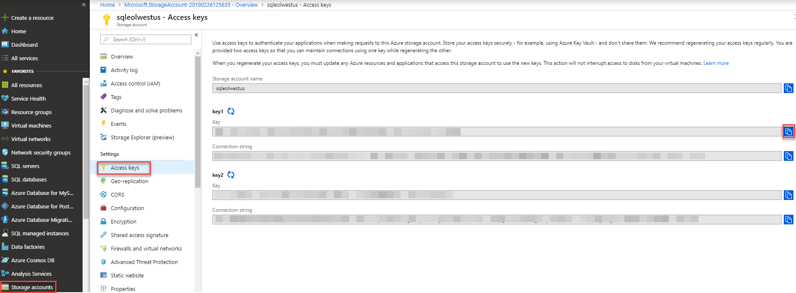

Windows-Server-and-SQL-Server-2008-R2-End-of-Support-Planning

Hands-on lab step-by-step

March 2019

Information in this document, including URL and other Internet Web site references, is subject to change without notice. Unless otherwise noted, the example companies, organizations, products, domain names, e-mail addresses, logos, people, places, and events depicted herein are fictitious, and no association with any real company, organization, product, domain name, e-mail address, logo, person, place or event is intended or should be inferred. Complying with all applicable copyright laws is the responsibility of the user. Without limiting the rights under copyright, no part of this document may be reproduced, stored in or introduced into a retrieval system, or transmitted in any form or by any means (electronic, mechanical, photocopying, recording, or otherwise), or for any purpose, without the express written permission of Microsoft Corporation.

Microsoft may have patents, patent applications, trademarks, copyrights, or other intellectual property rights covering subject matter in this document. Except as expressly provided in any written license agreement from Microsoft, the furnishing of this document does not give you any license to these patents, trademarks, copyrights, or other intellectual property.

The names of manufacturers, products, or URLs are provided for informational purposes only and Microsoft makes no representations and warranties, either expressed, implied, or statutory, regarding these manufacturers or the use of the products with any Microsoft technologies. The inclusion of a manufacturer or product does not imply endorsement of Microsoft of the manufacturer or product. Links may be provided to third party sites. Such sites are not under the control of Microsoft and Microsoft is not responsible for the contents of any linked site or any link contained in a linked site, or any changes or updates to such sites. Microsoft is not responsible for webcasting or any other form of transmission received from any linked site. Microsoft is providing these links to you only as a convenience, and the inclusion of any link does not imply endorsement of Microsoft of the site or the products contained therein.

© 2018 Microsoft Corporation. All rights reserved.

Microsoft and the trademarks listed at <https://www.microsoft.com/en-us/legal/intellectualproperty/Trademarks/Usage/General.aspx> are trademarks of the Microsoft group of companies. All other trademarks are property of their respective owners.

**Contents** 

<!-- TOC -->

- [\[insert workshop name here\] hands-on lab step-by-step](#\insert-workshop-name-here\-hands-on-lab-step-by-step)
    - [Abstract and learning objectives](#abstract-and-learning-objectives)
    - [Overview](#overview)
    - [Solution architecture](#solution-architecture)
    - [Requirements](#requirements)
    - [Before the hands-on lab](#before-the-hands-on-lab)
    - [Exercise 1: Failover the IIS machine using ASR](#Exercise-1:-Failover-the-IIS-machine-using-ASR)
        - [Task 1: Perform a test failover](#task-1-Perform-a-test-failover)
    - [Exercise 2: Recover SQL Server 2008 R2 to another region via Backup/Restore](#Exercise-2:-Recover-SQL-Server-2008-R2-to-another-region-via-Backup/Restore)
        - [Task 1: Create SQL Server 2008 R2 Machine](#task-1-Create-SQL-Server-2008 R2-Machine)
        - [Task 2: Task name](#task-2-task-name-1)
    - [Exercise 3: Exercise name](#exercise-3-exercise-name)
        - [Task 1: Task name](#task-1-task-name-2)
        - [Task 2: Task name](#task-2-task-name-2)
    - [After the hands-on lab](#after-the-hands-on-lab)
        - [Task 1: Task name](#task-1-task-name-3)
        - [Task 2: Task name](#task-2-task-name-3)

<!-- /TOC -->

# Windows Server and SQL Server 2008 R2 end of support planning hands-on lab step-by-step 

## Abstract and learning objectives 

In this lab you will be leveraging Azure Site Recovery to perform a lift and shift to Azure for Windows Server 2008 R2 VM hosting IIS and using the [Microsoft® SQL Server® Backup to Microsoft Azure®Tool](https://www.microsoft.com/en-us/download/details.aspx?id=40740) to stream the backup to Azure blob storage

## Overview

Contoso Finance runs on Windows 2008R2/ SQL 2008R2 on-premises. They purchased an **ISV** application, which requires an upgrade in order to support newer versions of SQL.

They have decided to **REHOST** the application in Azure to continue to get security and stay current as they 

evaluate other ISV solutions to meet their growing business needs.

## Solution architecture

## Requirements

1.  Completed the [Before the HOL - Windows Server and SQL Server 2008 R2 EOS](https://github.com/pansaty/MCW-Windows-Server-and-SQL-Server-2008-R2-End-of-Support-Planning/blob/master/Hands-on%20lab/Before%20the%20HOL%20-%20Windows%20Server%20and%20SQL%20Server%202008%20R2%20EOS.md)
2.  [Microsoft® SQL Server® Backup to Microsoft Azure®Tool](https://www.microsoft.com/en-us/download/details.aspx?id=40740)
3.  Port 443 open from the SQL Server VM to *.blob.core.windows.net

## Before the hands-on lab

Refer to the Before the hands-on lab setup guide manual before continuing to the lab exercises.

## Exercise 1: Failover the IIS machine using ASR

Duration: 15 minutes

In this exercise we will be leveraging ASR to failover the IIS machine to another region to simulate failover from on-premise to Azure.

### Task 1: Perform a test failover

1. Open the [Azure Portal](https://www.portal.azure.com)

2. Open the Recovery Vault that you created in Before the Hands-On lab

3. Navigate to **Replicated items**

4. Select the Windows 2008 R2 IIS VM that we protected

5. Replication status should show Healthy if the environment is ready to failover, click on Test Failover

   

6. On the **Test failover** blade choose the latest processed recovery point and select the Azure Virtual Network you created in Task 7 of Before the Hands-On Lab, which will simulate your Azure Region

7. While this is happening, you can move on to the next Exercise 

## Exercise 2: Recover SQL Server 2008 R2 to another region via Backup/Restore

Duration: 10 minutes

To simulate building out a SQL 2008 R2 machine in Azure for migrating from on-premise to Azure, we will leverage the Gallery image for SQL Server 2008 R2.

**Note:** If you have active Software Assurance and wish to bring your own license to Azure, you will need to create a custom image with SQL Server 2008 R2 media from your volume licensing site

### Task 1: Create SQL Server 2008 R2 Machine

1.  Open the [Azure Portal](https://www.portal.azure.com)

2.  Click the 
3.  Search for SQL Server 2008 R2 and choose the SQL Server 2008 R2 SP3 Enterprise on Windows Server 2008 R2 image

4.  Ensure you are creating the VM in the same resource group as the **Network created in Task 7 of Before the Hands-On lab** 
5.  Provide a unique name
6.  Choose the same region where you are replicating the Windows Server 2008 R2 IIS VM
7.  Change the size of the VM to a DS11_v2 
8.  Specify your admin Username and Password
9.  Under Inbound port rules, only enable **RDP 3389**
10.  On the networking page, the virtual network should be the same you created in Task 7 of Before the Hands-On Lab
11.  Click **Review + create** and once validation is completed, click **Create**

## Exercise 3: Backup SQL Database to Storage account

Duration: 15 minutes

In this exercise we will be configuring the Microsoft SQL Server Backup to Microsoft Azure Tool to stream backups from local folder location on the SQL Server VM to an Azure blob storage account.

### Task 1: Create Azure Storage Account

1. Open the [Azure Portal](https://www.portal.azure.com)
2. Click the 
3. Select **Storage** and choose **Storage Account**
4. Select the same resource group that you created the SQL 2008R2 VM in Exercise 2
5. Provide a unique storage account name
6. For location, choose the same region as the SQL 2008R2 VM in Exercise 2
7. Choose Standard performance tier
8. Account Kind: default value
9. Replication: Locally-redundant storage
10. Click **Review + create** and once validation is completed, click **Create**

### Task 2: Create a container for backups and retrieve the Storage Account keys

1. Once the storage account is create (Should take less than a minute), navigate to the newly created storage account

2. Under **Blob service**, click on Blobs then click on **+ Container**

   1. Create a container named backups and click ok

3. As the Microsoft SQL Server Backup to Windows Azure Tool is an older tool, it does not support storage accounts where only Secure Transfer is enabled (default). If in your environment this is not suitable, you can leverage [AZCopy](https://docs.microsoft.com/en-us/azure/storage/common/storage-use-azcopy) to transfer the backup files to blob storage in Azure. For simplicity we will be leveraging the tool. 

   1. Click on configuration Set **Secure transfer required** option to disabled and click **Save**

4. Under Access Keys, copy key1 to your clipboard/notepad as we will need this for the next task

   

### Task 3: Configure Microsoft SQL Server Backup to Microsoft Azure tool

1. Within the Azure Portal, navigate to Virtual Machines

2. Select the Source SQL Server 2008 R2 Machine created in the Before the Hands-On Labs

3. Click connect to RDP into the SQL Server VM

4. Create a folder at the root of the C: called Backups

5. Download the [Microsoft® SQL Server® Backup to Microsoft Azure®Tool](https://www.microsoft.com/en-us/download/details.aspx?id=40740)

6. Open the Microsoft® SQL Server® Backup to Microsoft Azure®Tool

   1. Click **Add ** on the **Rules** page
   2. On the **Step 1 of 3** page select the  **A specific path:** radial and browse to C:\Backups. Use the file pattern *.bak and click next
   3. On the **Step 2 of 3** page, 
      1. Enter the storage account name create in Task 1, ex: sqleolwestus
      2. Paste in the Access Key copied in the previous task
      3. Enter **backups** as the **container name**
      4. Click on **Verify account** to ensure settings are correct
      5. Click Next

   4. On the **Step 2 of 3** page,
      1. Select the **Enable encryption** radial and provide a strong password
      2. Leave **Enable compression** selected 
      3. click **Finish**

### Task 4: Backup and Restore Database

1.  Launch SQL Server Management Studio for the Source SQL Server 2008 R2 VM
2.  Backup the ContosoFinance database to the folder monitored by the Microsoft® SQL Server® Backup to Microsoft Azure®Tool, i.e C:\Backups
3.  Browse to C:\Backups and notice the backup size of only 23KB as this is only the stub file that contains the metadata of where the actual backup is on blob storage

 

## After the hands-on lab 

Duration: X minutes

\[insert your custom Hands-on lab content here . . .\]

### Task 1: Task name

1. Number and insert your custom workshop content here . . .

   a.  Insert content here

       i.  

### Task 2: Task name

1. Number and insert your custom workshop content here . . .

   a.  Insert content here

       i.  

   You should follow all steps provided *after* attending the Hands-on lab.

