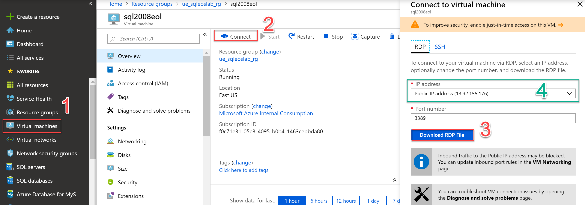
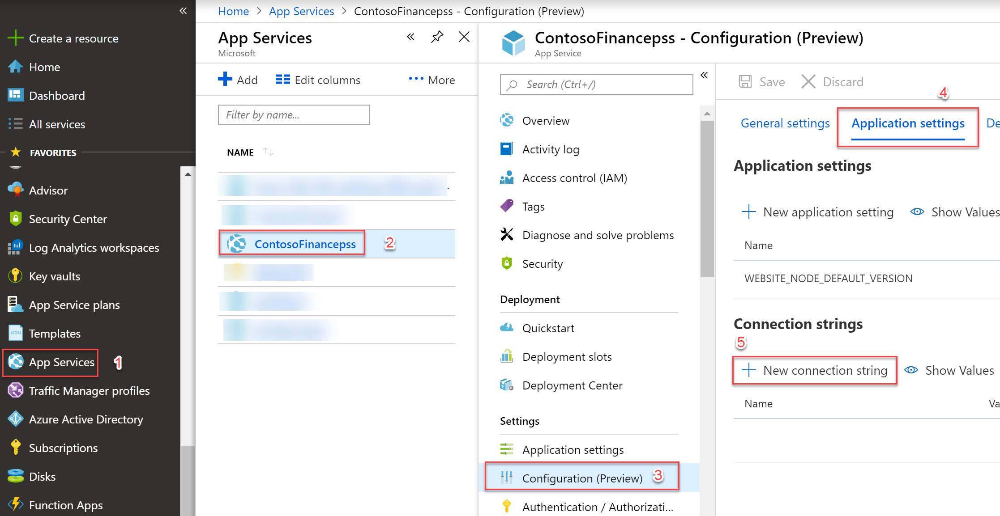

Windows Server and SQL Server 2008 R2 end of support planning

Before the hands-on lab setup guide

March 2019

Information in this document, including URL and other Internet Web site references, is subject to change without notice. Unless otherwise noted, the example companies, organizations, products, domain names, e-mail addresses, logos, people, places, and events depicted herein are fictitious, and no association with any real company, organization, product, domain name, e-mail address, logo, person, place or event is intended or should be inferred. Complying with all applicable copyright laws is the responsibility of the user. Without limiting the rights under copyright, no part of this document may be reproduced, stored in or introduced into a retrieval system, or transmitted in any form or by any means (electronic, mechanical, photocopying, recording, or otherwise), or for any purpose, without the express written permission of Microsoft Corporation.

Microsoft may have patents, patent applications, trademarks, copyrights, or other intellectual property rights covering subject matter in this document. Except as expressly provided in any written license agreement from Microsoft, the furnishing of this document does not give you any license to these patents, trademarks, copyrights, or other intellectual property.

The names of manufacturers, products, or URLs are provided for informational purposes only and Microsoft makes no representations and warranties, either expressed, implied, or statutory, regarding these manufacturers or the use of the products with any Microsoft technologies. The inclusion of a manufacturer or product does not imply endorsement of Microsoft of the manufacturer or product. Links may be provided to third party sites. Such sites are not under the control of Microsoft and Microsoft is not responsible for the contents of any linked site or any link contained in a linked site, or any changes or updates to such sites. Microsoft is not responsible for webcasting or any other form of transmission received from any linked site. Microsoft is providing these links to you only as a convenience, and the inclusion of any link does not imply endorsement of Microsoft of the site or the products contained therein.

© 2018 Microsoft Corporation. All rights reserved.

Microsoft and the trademarks listed at <https://www.microsoft.com/en-us/legal/intellectualproperty/Trademarks/Usage/General.aspx> are trademarks of the Microsoft group of companies. All other trademarks are property of their respective owners.

**Contents**

[TOC]

# Windows Server and SQL Server 2008 R2 end of support planning before the hands-on lab setup guide 
## Requirements

1.  Microsoft Azure subscription
2.  [Azure CLI](https://docs.microsoft.com/en-us/cli/azure/install-azure-cli?view=azure-cli-latest) 
3.  Download the [ContosoFinance.zip](https://github.com/pansaty/MCW-Windows-Server-and-SQL-Server-2008-R2-End-of-Support-Planning/blob/master/Hands-on-lab/lab-files/ContosoFinance.zip) deployment from Github
4.  [JSON deployment template](https://github.com/pansaty/MCW-Windows-Server-and-SQL-Server-2008-R2-End-of-Support-Planning/blob/master/Hands-on-lab/lab-files/sql2008r2VM.json) and [parameters file](https://github.com/pansaty/MCW-Windows-Server-and-SQL-Server-2008-R2-End-of-Support-Planning/blob/master/Hands-on-lab/lab-files/parameters.json) from Github

## Before the hands-on lab

Duration: 30 minutes

In order to focus on the options for moving SQL to Azure, this lab will be targeted to tools and options for migrating database to Azure. The lab assumes that you have already refactored your application for Azure App Services. In a scenario where you may need to keep the application intact as it were on-prem, consider using Azure Site Recovery. 

### Task 1: Create a SQL 2008R2 VM in Azure 

1. With the [Azure CLI](https://docs.microsoft.com/en-us/cli/azure/install-azure-cli?view=azure-cli-latest) installed on your machine, open a PowerShell command prompt and run the following steps to Create a SQL 2008 R2 machine

   1. `az login` to login to your subscription. You will be prompted for credentials to authenticate to your account via web browser.

   2. `az group create --name ue_sqleoslab_rg --location "East US"`  to create a resource group for all items you will be creating for this lab

   3. Ensure that you have downloaded the  [JSON deployment template](https://github.com/pansaty/MCW-Windows-Server-and-SQL-Server-2008-R2-End-of-Support-Planning/blob/master/Hands-on-lab/lab-files/sql2008r2VM.json) and [parameters file](https://github.com/pansaty/MCW-Windows-Server-and-SQL-Server-2008-R2-End-of-Support-Planning/blob/master/Hands-on-lab/lab-files/parameters.json) from Github, then leverage the below to deploy a SQL 2008 R2 IaaS VM

      `az group deployment create --resource-group ue_sqleoslab_rg --name SQL2008R2Deployment --template-file [PathToJSONTemplace]\sql2008r2VM.json  --parameters @[PathToParametersFile]\parameters.json` 

      **Note:** This template used a Pay As You Go with the SQL License included Image from the marketplace. If you have active SA and wish to Bring Your Own License, you will have to build a custom image and publish to your subscription

2. Leave the PowerShell command running and go to the next task. It should take < 10 mins to provision this VM

### Task 2: Setup the ContosoFinance Website

1. Open a new PowerShell command prompt, run the following to deploy the ContosoFinance website
   1. `az appservice plan create -g ue_sqleoslab_rg -n ContosoFinance` to create the app service plan
   2. `az webapp create -g ue_sqleoslab_rg -p ContosoFinance -n ContosoFinance[initials]` to create an App Service plan for your web application, replacing the [place_holders] for your resource group and WebApp name. **Note:** Your WebApp name must be universally unique.
   3. `az webapp deployment source config-zip --resource-group ue_sqleoslab_rg --name ContosoFinance[initials] --src [pathtozip]\ContosoFinance.zip` to deploy the ContosoFinance webapp
2. Close the PowerShell command prompt

### Task 3: Restore the ContosoFinance  SQL Server Backup file

This task is representative of the effort needed to lift and shift a SQL Server 2008R2 instance from on-prem to Azure leveraging a backup/restore methodology. This can be enhanced using the [Microsoft® SQL Server® Backup to Microsoft Azure®Tool](https://www.microsoft.com/en-us/download/details.aspx?id=40740) to backup directly from On-Prem SQL Server to Azure blob storage, however this will require port 443 open from all source SQL Server instances. If this is not an option, you can backup to a central server and then leverage azcopy from a central server to copy backups to Azure blob storage. In addition if you were looking to do a minimal downtime migration for lift and shift where the target in Azure needs to be a SQL Server 2008 R2 instance, you could explore leveraging log shipping.

1. Login to the [Azure Portal](https://portal.azure.com)

2. Navigate to Virtual Machines and download the RDP file for the SQL 2008 R2 VM created in Task 1 and login to it using the credentials from the parameters.json file. If the parameters file is unchanged, use username: **sql2008admin** and password: **P@ssw0rd1234**. Make note of the Public IP address (4).

   

3. Download the [ContosoFinance.bak](https://github.com/pansaty/MCW-Windows-Server-and-SQL-Server-2008-R2-End-of-Support-Planning/blob/master/Hands-on-lab/lab-files/ContosoFinance.bak) file from GitHub and restore it to the newly created SQL 2008R2 VM. **Note:** In a real migration scenario from on-prem, you could stage the backup file in an Azure blob storage account. 

4. Enable SQL Authentication and restart the SQL Services. If you are not sure how to do this see [here](https://docs.microsoft.com/en-us/sql/database-engine/configure-windows/change-server-authentication-mode?view=sql-server-2017)

5. Launch SSMS and run the following to create a login for the application and grant permissions needed

   `USE [master]
   GO
   CREATE LOGIN [AppUser] WITH PASSWORD=N'P@ssw0rd1234', DEFAULT_DATABASE=[ContosoFinance], CHECK_EXPIRATION=OFF, CHECK_POLICY=OFF
   GO
   Use [ContosoFinance]
   GO
   CREATE USER [AppUser] From Login [AppUser]
   GO
   exec sp_addrolemember [db_datareader] , [AppUser]
   exec sp_addrolemember [db_datawriter] , [AppUser]
   GRANT EXECUTE on [dbo].[GetEngineEdition] to [AppUser]
   GRANT EXECUTE on [dbo].[usp_CustomerWithNoVisits] to [AppUser]
   GO`

6. Create a firewall rule to allow inbound on port 1433. If you are not sure how to do this see [here](https://docs.microsoft.com/en-us/sql/database-engine/configure-windows/configure-a-windows-firewall-for-database-engine-access?view=sql-server-2017)

### Task 4: Configure Connection string for the ContosoFinance site

1. Within the [Azure Portal](https://portal.azure.com) navigate to Azure Websites

2. Open App Services(1)->You Web App deployed in Task 2 (2) ->Configuration (Preview) (3) -> Application Settings (4) -> + New Connection (5)

   

3. Add a New Connection String

   1. Name: `DefaultConnection`
   2. Value: `Data Source=[Public IP of SQL VM]; Initial Catalog=contosofinance; User ID=AppUser;Password=P@ssw0rd1234`.
   3. Type: `SQLServer`

4. Go to the Overview page of the ContosoFinance App Service and click on the URL ex: https://contosofinancepss.azurewebsites.net

5. ContosoFinance website will launch successfully if configuration steps completed successfully, take note of the SQL Version listed. 

   

You should follow all steps provided *before* performing the Hands-on lab.

